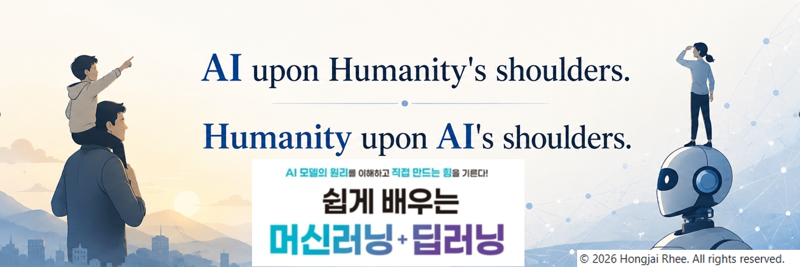

  

*AI was born from the collective knowledge of humanity, and humanity now reaches new heights on the shoulders of AI.*
*We explore the harmonious interplay of technology, philosophy, and mutual progress.*

### 📝 이 책의 독자들을 위한 파일 저장소입니다. 
📢 [[저자]](./docs/Author.md), [[책머리말]](./docs/책머리말.md)
> ⚠️ *All other uses are strictly prohibited!!!*

> [!IMPORTANT]
>
> **디렉토리**별 파일은 다음과 같으며 필요에 따라 수정/보완됩니다.
> 
> **/notebook** 장별 ipynb 노트북💻 파일(zip): 책의 실습 코드와 토픽별로 선별된 유튜브 링크 및 보충 자료 포함
> 
> **/exercise** 장별 되새김 문제 정답💡 코드(zip): 복습을 위한 연습 문제 
> 
> **/data** 실습 데이터📊 모음

📢 코드와 데이터의 사용 조건은 [라이선스](./docs/LICENSE.md)를 참조하세요.

📢 이 저장소의 모든 파일들은 출판사 자료실에서도 다운로드할 수 있습니다.
> 
📢 공지사항과 최신 업데이트는 [공지사항 페이지](./docs/)에서 확인하실 수 있습니다. 

---

### 💬 코드 에러 및 오탈자 제보
⚡ [GitHub Issues 바로가기](https://github.com)에 스크린샷과 함께 글을 남겨주세요.
* 독자님이 글을 남기시면 저자에게 즉시 알림이 전송됩니다.
* 효과적인 피드백을 위한 [준수 사항](./CODE_OF_CONDUCT.md)을 지켜주세요.

---

